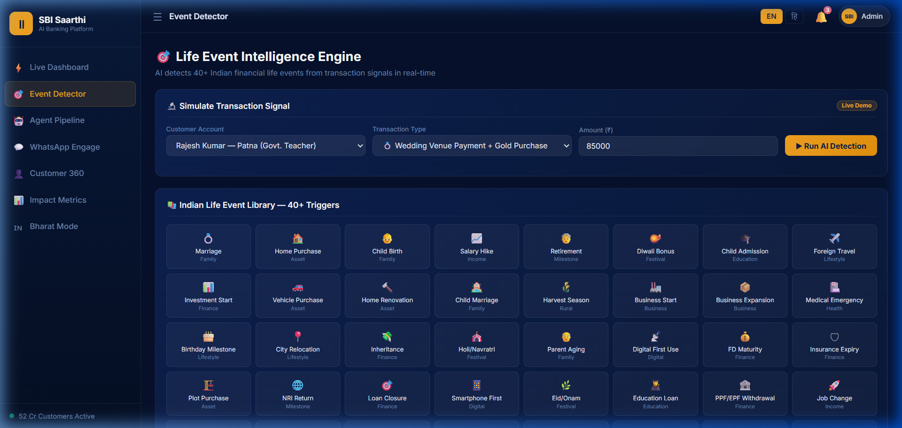
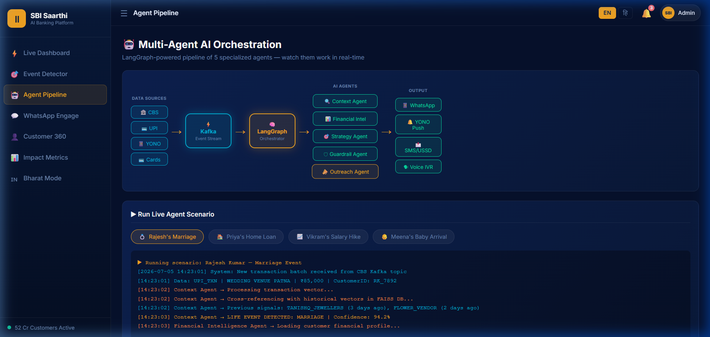
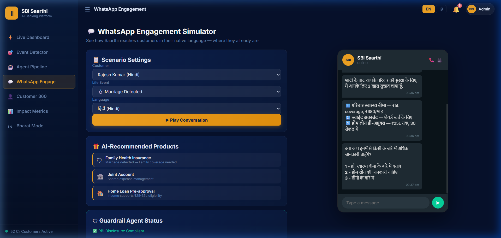
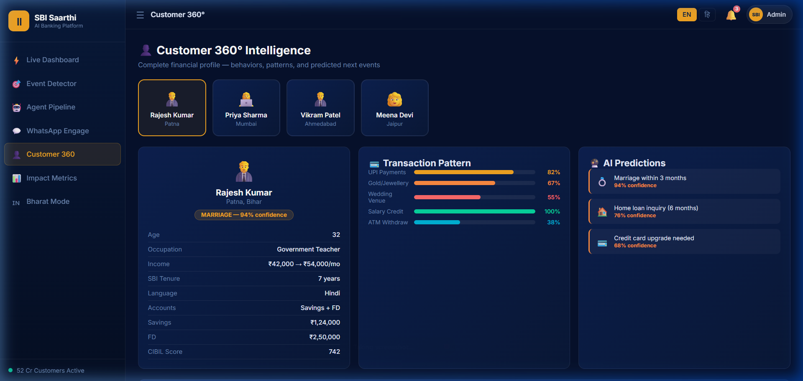
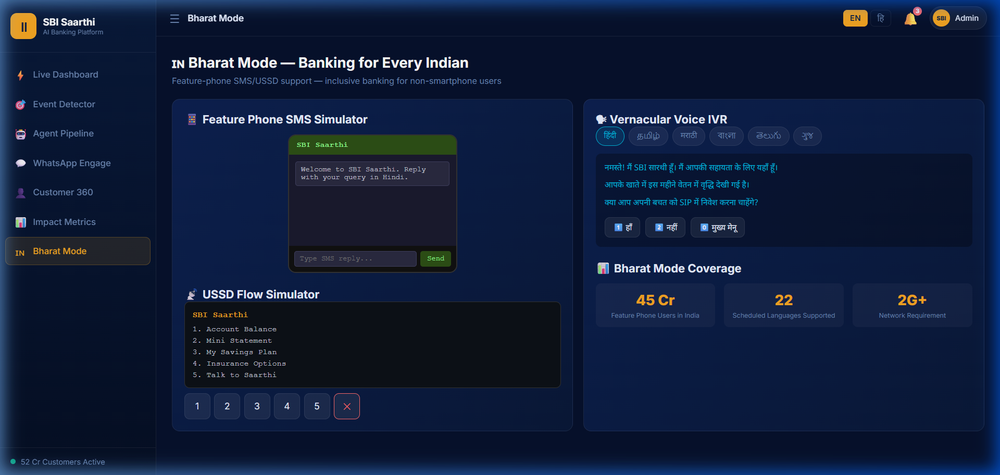

# SBI Saarthi — Agentic AI Financial Charioteer

> **Hackathon:** SBI Hackathon @ GFF2026
> **Theme:** Agentic AI for Digital Engagement

## 🚨 The Problem

Banks today face increasing challenges in creating meaningful, long-term customer engagement. While digital banking adoption has skyrocketed, interactions remain largely **reactive**. Customers only interact with their bank when they have a problem or an immediate transactional need. 

Current outreach models are often:
1. **Generic:** Mass marketing campaigns that ignore individual context.
2. **Untimely:** Credit card offers sent when a customer is looking for an education loan.
3. **Exclusive:** Designed primarily for smartphone users, ignoring the 45+ crore feature phone users in India.

**The result:** Low conversion rates (often <10%), high customer acquisition costs, and missed opportunities to truly partner in the customer's financial journey.

---

## 💡 Our Solution: SBI Saarthi

**SBI Saarthi** is an Agentic AI platform that proactively engages SBI's 52 crore customers based on real-time behavioral signals, financial patterns, and Indian life events — before the customer even thinks to ask.

Inspired by the Indian concept of **"Saarthi"** (the proactive charioteer who guides without being commanded) and **"Munim-ji"** (the trusted family accountant), Saarthi autonomously monitors transaction streams to detect 40+ culturally relevant life events.

When an event is detected, Saarthi instantly triggers personalized, RBI-compliant financial recommendations delivered via WhatsApp, YONO, SMS/USSD, or Voice IVR in 6 Indian languages.

### 🌟 Key Features

#### 1. Real-time Event Detection
Detects 40+ Indian life events like Marriage, Home Purchase, Child Birth, Salary Hike, and even Harvest Season for rural customers, using transaction vectors and AI confidence scoring.


#### 2. Multi-Agent Pipeline Architecture
Powered by LangGraph, 5 specialized AI agents work in tandem:
- **Context Agent:** Analyzes behavioral patterns
- **Financial Intelligence:** Reviews income and CIBIL
- **Strategy Agent:** Matches products to life events
- **Guardrail Agent:** Ensures strict RBI/SEBI compliance
- **Outreach Agent:** Delivers vernacular messages


#### 3. Proactive Vernacular Engagement
Engages customers in their native language (Hindi, Tamil, Marathi, etc.) through familiar channels like WhatsApp, achieving conversion rates up to 4.5x higher than traditional methods.


#### 4. Customer 360° Intelligence
Maintains a deep understanding of each customer's financial health, transaction patterns, and predicted future needs.


#### 5. "Bharat Mode" for Financial Inclusion
Not everyone has a smartphone. Saarthi extends its AI intelligence to feature phones via SMS chatbots, USSD menus, and multi-lingual Voice IVR, reaching the deepest parts of rural India.


---

## 🚀 The Prototype

This repository contains the fully functional, interactive frontend prototype of the SBI Saarthi platform.

### How to Run Locally

1. Clone the repository:
   ```bash
   git clone https://github.com/arnamchaurasiya/SBI-Saarthi.git
   ```
2. Navigate to the folder:
   ```bash
   cd SBI-Saarthi
   ```
3. Start a local server (using Python):
   ```bash
   python -m http.server 8765
   ```
4. Open your browser and go to:
   ```
   http://localhost:8765
   ```

---
*Built with ❤️ for the SBI Hackathon @ GFF2026*
